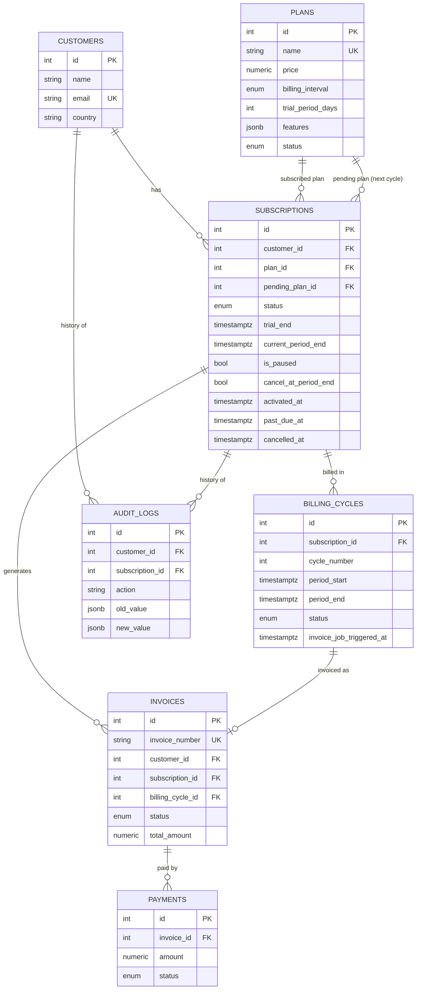
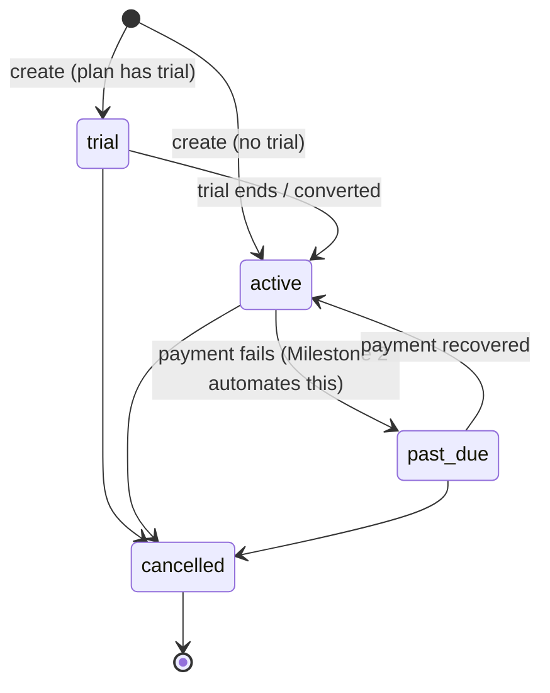

# Database ERD (Milestone 1)

GitHub renders this diagram automatically.

```mermaid
erDiagram
    CUSTOMERS ||--o{ SUBSCRIPTIONS : "has"
    PLANS ||--o{ SUBSCRIPTIONS : "subscribed plan"
    PLANS ||--o{ SUBSCRIPTIONS : "pending plan (next cycle)"
    SUBSCRIPTIONS ||--o{ BILLING_CYCLES : "billed in"
    SUBSCRIPTIONS ||--o{ INVOICES : "generates"
    BILLING_CYCLES ||--o| INVOICES : "invoiced as"
    INVOICES ||--o{ PAYMENTS : "paid by"
    CUSTOMERS ||--o{ AUDIT_LOGS : "history of"
    SUBSCRIPTIONS ||--o{ AUDIT_LOGS : "history of"

    PLANS {
        int id PK
        string name UK
        numeric price
        enum billing_interval
        int trial_period_days
        jsonb features
        enum status
    }
    CUSTOMERS {
        int id PK
        string name
        string email UK
        string country
    }
    SUBSCRIPTIONS {
        int id PK
        int customer_id FK
        int plan_id FK
        int pending_plan_id FK
        enum status
        timestamptz trial_end
        timestamptz current_period_end
        bool is_paused
        bool cancel_at_period_end
        timestamptz activated_at
        timestamptz past_due_at
        timestamptz cancelled_at
    }
    BILLING_CYCLES {
        int id PK
        int subscription_id FK
        int cycle_number
        timestamptz period_start
        timestamptz period_end
        enum status
        timestamptz invoice_job_triggered_at
    }
    INVOICES {
        int id PK
        string invoice_number UK
        int customer_id FK
        int subscription_id FK
        int billing_cycle_id FK
        enum status
        numeric total_amount
    }
    PAYMENTS {
        int id PK
        int invoice_id FK
        numeric amount
        enum status
    }
    AUDIT_LOGS {
        int id PK
        int customer_id FK
        int subscription_id FK
        string action
        jsonb old_value
        jsonb new_value
    }
```

## Subscription state machine

```mermaid
stateDiagram-v2
    [*] --> trial: create (plan has trial)
    [*] --> active: create (no trial)
    trial --> active: trial ends / converted
    trial --> cancelled
    active --> past_due: payment fails (Milestone 2 automates this)
    active --> cancelled
    past_due --> active: payment recovered
    past_due --> cancelled
    cancelled --> [*]
```
